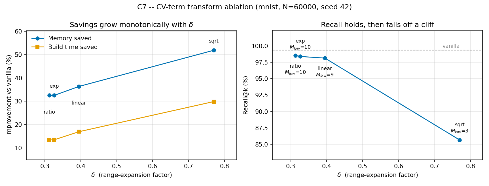

# C7 — CV-term transform ablation

Review comment C7 asks whether the specific form of the CV term in Eq. (2)-(5)
is justified or arbitrary. The original research validated it but kept no
results, so it was re-run from scratch here.

```bash
python scripts/run_c7_ablation.py --seed 42 \
    --out ablation/c7_cv_transform_mnist.csv \
    --plot ablation/c7_cv_transform_mnist.png
```

MNIST, 60,000 base vectors, 100 queries, seed 42, λ = 1.5, M = 16, ef_ref = 149.
Environment: i7-12700F, 94 GB, conda env `dhnsw`, 2026-09-04. One run per
variant (range dial 1 in `PLAN.md`).

## What each variant does

All four map the local-density spread onto **δ**, the fraction of `M`/`ef` that
the per-node range is widened by: `M ∈ [M(1−δ), M(1+δ)]`, likewise for `ef`.
They differ only in that mapping. `linear` is the paper's formula, unchanged.

| Variant | δ from CV | Bounded? |
|---|---|---|
| `linear` | `CV · λ` | no |
| `exp` | `1 − exp(−CV · λ)` | yes, δ < 1 |
| `sqrt` | `√CV · λ` | no |
| `ratio` | `CV' · λ`, where `CV' = σ/(μ+σ)` | yes, δ < λ |

## Results

| Variant | δ | M range | Build time | vs vanilla | Memory | vs vanilla | Recall | vs vanilla | Avg degree |
|---|---|---|---|---|---|---|---|---|---|
| vanilla | — | M = 16 | 646.24 s | — | 153.33 MB | — | 99.33 % | — | 30.99 |
| `ratio` | 0.313 | [10, 21] | 559.41 s | −13.44 % | 103.40 MB | −32.56 % | 98.52 % | −0.81 %p | 19.59 |
| `exp` | 0.326 | [10, 21] | 558.99 s | −13.50 % | 103.43 MB | −32.55 % | 98.39 % | −0.94 %p | 19.59 |
| **`linear`** | **0.395** | **[9, 22]** | **536.58 s** | **−16.97 %** | **97.56 MB** | **−36.37 %** | **98.14 %** | **−1.19 %p** | **17.78** |
| `sqrt` | 0.770 | [3, 28] | 453.17 s | −29.88 % | 73.80 MB | −51.87 % | 85.66 % | −13.67 %p | 9.42 |



## Reading

**The four forms do not differ in kind — only in the δ they produce, and every
metric is monotone in that one scalar.** `exp` and `ratio` are different
functions of different dispersion measures, yet they land 4.2 % apart in δ and
are then indistinguishable in the graph they build: average degree differs by
0.005 %, build time by 0.076 %, peak memory by 0.022 %. Nothing about the
functional form survives once δ is fixed. (That agreement doubles as a noise
check: two independent full builds at effectively the same operating point
matched to well under 0.1 %, so the within-run ordering of build times is real.)

**On one dataset, therefore, changing the transform is exactly equivalent to
re-scaling λ.** Each variant's δ is reproduced by `linear` at an equivalent
λ = δ/CV: 1.19 for `ratio`, 1.24 for `exp`, 2.92 for `sqrt`, against the
paper's 1.5. The transforms add no expressive power the existing λ knob does
not already have. The forms can only diverge *across* datasets with different
CV — which is where a follow-up belongs, not here (see below).

**The recall cliff is caused by M_low, not by the choice of form.** `sqrt`
looks gentle as a function shape, but √CV > CV whenever CV < 1, and real data
sits at CV ≈ 0.26 — so in the regime that actually occurs it is the *most*
aggressive variant, not the mildest. Its δ = 0.77 drives M_low to 3, average
degree to 9.42, and recall off a cliff to 85.66 %. Above roughly δ ≈ 0.5 the
sparse-region nodes are left with too few edges to stay reachable, and the
savings stop being worth having. (`PLAN.md` predicted `sqrt` would be a
"gentle increase"; that premise was wrong for this CV regime.)

**The paper's `linear` at λ = 1.5 sits at a defensible point on that curve** —
the largest savings still on the flat part, before the cliff. It is not
dominated: it buys 3.5 pp more build-time saving and 3.8 pp more memory saving
than `exp`/`ratio` for 0.25–0.38 %p more recall loss. That is a genuine
trade-off along one frontier, not a mistake in the choice of form.

## Verification against the golden master

`linear` must reproduce `baseline/dhnsw_mnist.csv`, and does:

| | Golden master | This run | Δ |
|---|---|---|---|
| CV | 0.2633617197445662 | 0.2633617197445662 | exact |
| Average degree | 17.785315 | 17.781483 | −0.022 % |
| Peak memory | 97.36 MB | 97.56 MB | +0.213 % |
| Recall | 98.17 % | 98.14 % | −0.031 %p |
| Build time | 549.29 s | 536.58 s | −2.32 % |

The CV matches to all 16 digits, so the density estimate and the `linear` path
are bit-identical to the pre-change code. The small spread in degree, memory
and recall is the unseeded `random()` level assignment in `dhnsw.py`; build
time additionally carries machine noise (vanilla measured 646.24 s here against
610.73 s for the golden master, a 5.8 % spread across runs).

## Caveats and what would come next

One seed, one dataset, one run per variant — range dial 1. Build-time
*improvement* figures are the noise-sensitive ones, since they divide two
separately measured timings; memory, average degree and recall were stable to
~0.2 % across runs and carry the argument.

The open question this raises is the cross-dataset one: because `exp` and
`ratio` are bounded and `linear`/`sqrt` are not, they can only be separated by
a dataset whose CV is high enough for the unbounded forms to degenerate
(δ > 1 floors M_low at 2 and ef_low at 10). At λ = 1.5 that needs CV > 0.67;
MNIST's 0.26 is nowhere near it. Measuring CV for GloVe100K / SIFT1M / GIST1M
is cheap — it needs the density estimate only, not a graph build — and would
settle whether the bounded forms have any practical advantage at all.
