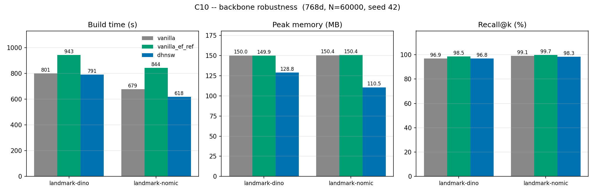

# C10 — does the gain survive a change of backbone?

`landmark-dino-768` and `landmark-nomic-768` are the same 760,757 images at the
same 768 dimensions, encoded by different models (DINOv2 and Nomic Vision).
Corpus, cardinality, dimension and metric are all held fixed, so the only thing
that varies is the encoder — as controlled a test of backbone sensitivity as
this data allows.

```bash
python scripts/run_hdf5_experiment.py --datasets landmark-dino landmark-nomic \
    --num-vectors 60000 --variants vanilla vanilla_ef_ref dhnsw --stem c10_backbone
# -> results/phase1/c10_backbone.{csv,png}
```

60,000 base vectors per dataset (subsampled under seed 42), 100 queries,
ground truth recomputed over the subsample. `landmark-dino` ships unnormalised
(norms ≈ 66) and `landmark-nomic` unit-norm, so both are L2-normalised at load;
on the unit sphere Euclidean ranking is cosine ranking, which is the metric
both files declare. ef_ref = 149 at 768d, so the matched-ef control from C3 is
carried over here too. Environment: i7-12700F, 94 GB, conda env `dhnsw`,
2026-09-04.

## Results

| Backbone | Variant | Build time | Peak memory | Recall@100 | Avg degree |
|---|---|---|---|---|---|
| dino | vanilla (ef=100) | 801.09 s | 150.00 MB | 96.86 % | 31.00 |
| dino | vanilla at ef=149 | 943.12 s | 149.92 MB | 98.50 % | 31.03 |
| **dino** | **DHNSW** | **790.95 s** | **128.78 MB** | **96.78 %** | **23.40** |
| nomic | vanilla (ef=100) | 678.66 s | 150.42 MB | 99.07 % | 30.99 |
| nomic | vanilla at ef=149 | 844.34 s | 150.43 MB | 99.66 % | 30.99 |
| **nomic** | **DHNSW** | **618.43 s** | **110.52 MB** | **98.27 %** | **21.35** |

Against the paper's baseline (vanilla at ef = 100):

| Backbone | CV | δ | M range | Build time | Memory | Recall |
|---|---|---|---|---|---|---|
| dino | 0.1272 | 0.191 | [12, 19] | **−1.27 %** | **−14.15 %** | −0.08 %p |
| nomic | 0.2038 | 0.306 | [11, 20] | **−8.88 %** | **−26.52 %** | −0.80 %p |



## Reading

**The direction is robust; the magnitude is not.** DHNSW wins on both
backbones — smaller graph, faster build, recall within a percentage point —
so nothing about the method depends on the encoder in kind. But the memory
saving is 14.15 % on one and 26.52 % on the other, a factor of 1.9, on
*identical images at identical dimension*. A single-dataset number would have
overstated or understated the method by roughly a factor of two depending on
which encoder happened to be used.

**CV predicts which one you get.** The two backbones differ in exactly the
quantity C7 identified as the only thing that matters: nomic's embedding has
CV = 0.2038 against dino's 0.1272, so δ is 1.6× larger, the M range opens
wider, and the degree falls further (−31.1 % against −24.5 %). This is the
same mechanism C3 found across dimensions, now isolated at fixed dimension and
fixed data — which is the stronger form of the claim, because dimension and
corpus cannot be the explanation here.

**Taken with the other comments, one relationship explains all of them.**
Across every dataset measured in this chapter, the saving tracks the density
contrast of the embedding and nothing else:

| Dataset | Dim | CV | δ | Degree vs vanilla | Memory saved |
|---|---|---|---|---|---|
| MNIST | 784 | 0.2634 | 0.395 | −42.6 % | −36.4 % |
| landmark-nomic | 768 | 0.2038 | 0.306 | −31.1 % | −26.5 % |
| landmark-dino | 768 | 0.1272 | 0.191 | −24.5 % | −14.2 % |
| simplewiki-openai | 3072 | 0.0709 | 0.106 | −12.6 % | −5.9 % |

Monotone across four datasets, three dimensionalities and four unrelated
encoders. **DHNSW's benefit is a function of one measurable property of the
data, and that property can be computed before building anything** — the
density estimate costs 0.9 % of a build (C2), so a practitioner can decide
whether DHNSW is worth using on their corpus for essentially nothing.

**A note on the matched-ef control.** Against vanilla at the same ef = 149,
DHNSW's build-time advantage is much larger — 16.1 % on dino and 26.8 % on
nomic — because Eq. (1) makes DHNSW pay for a higher ef that the paper's
baseline does not. Both framings are in the table above. The paper's protocol
is vanilla at ef = 100 and that is what the headline figures use, but the
matched comparison is the one that isolates the adaptation itself.

## Caveats

One seed, one run per configuration, 60,000 of 760,757 points (range dial 1).
Build times carry the noise documented in C2; the memory, degree and CV figures
are the stable ones and they are what the argument rests on.

Two backbones is enough to show the magnitude varies and to identify CV as the
predictor, not enough to characterise the relationship. The four-dataset table
above is suggestive, not a fitted law — establishing that would need range
dial 2 and several more corpora.
