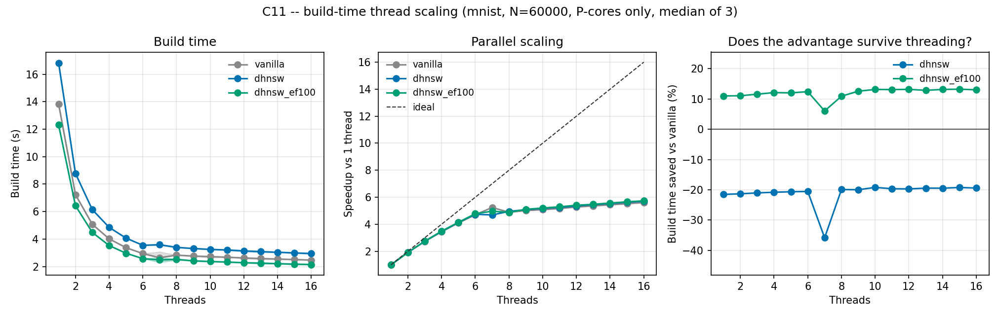

# C11 — build-time thread scaling

C11 asks whether DHNSW's build-time advantage survives parallel construction.
Pure-Python DHNSW has no parallel construction at all, so this required the
C++ port in `cpp/` (see `cpp/VENDORING.md`).

```bash
taskset -c 0-15 python scripts/run_c11_threads.py --seed 42
# -> results/phase1/c11_threads_mnist.{csv,png}
```

MNIST, 60,000 base vectors, 100 queries, seed 42, threads 1–16, three builds
per point (median reported). This is a build-time experiment — the paper does
not report QPS and neither does this.

**Core pinning.** The i7-12700F has 8 P-cores (two threads each, logical CPUs
0–15) and 4 slower E-cores (16–19). Everything here runs under
`taskset -c 0-15`, so a thread count is always P-core threads and the curve
measures scaling rather than core heterogeneity.

**Three arms.** DHNSW moves two knobs at once: per-node M (down, cheaper) and
per-node ef (up, since Eq. (1) puts ef_ref at 149 against the vanilla 100).
The third arm, `dhnsw_ef100`, keeps the per-node M and holds ef at 100, which
separates the two effects.

## Results

Median build time (s):

| Threads | vanilla | dhnsw | dhnsw_ef100 |
|---|---|---|---|
| 1 | 13.84 | 16.82 | 12.32 |
| 2 | 7.24 | 8.78 | 6.44 |
| 4 | 4.02 | 4.85 | 3.53 |
| 6 | 2.94 | 3.55 | 2.58 |
| 8 | 2.83 | 3.40 | 2.52 |
| 12 | 2.62 | 3.14 | 2.28 |
| 16 | 2.47 | 2.95 | 2.15 |

| | vanilla | dhnsw | dhnsw_ef100 |
|---|---|---|---|
| Build time vs vanilla, 1 thread | — | **−21.5 %** | **+11.0 %** |
| Build time vs vanilla, 16 threads | — | **−19.4 %** | **+13.0 %** |
| Stored edges | 1,015,054 | **809,108 (−20.3 %)** | **784,984 (−22.7 %)** |
| Recall@100 | 98.64 % | 98.12 % | 98.02 % |
| Speedup, 1 → 16 threads | 5.61× | 5.70× | 5.74× |



## Reading

**The direct answer to C11: threading changes nothing about the comparison.**
DHNSW's gap to vanilla is flat across the whole sweep — −21.5 % at one thread
and −19.4 % at sixteen, and `dhnsw_ef100`'s advantage likewise holds at
+11.0 % and +13.0 %. All three arms scale essentially identically (5.6–5.7×).
Whatever DHNSW's build-time advantage is, parallel construction neither
creates nor destroys it. No reviewer concern survives here.

**The uncomfortable finding is not about threads at all: in C++, DHNSW as
published builds ~20 % slower than vanilla.** In Python it built 7–17 %
faster. The port is what makes the cause visible, and the third arm isolates
it: with per-node M alone and ef held at 100, the C++ build is 11–13 % *faster*
than vanilla and stores 22.7 % fewer edges at the same recall. The entire
regression is Eq. (1) raising ef from 100 to a per-node mean of 140.8.

The two implementations disagree because they have different cost structures.
Python's build is dominated by per-edge distance calls in interpreted code, so
cutting average degree by 40 % dominates everything and the higher ef is
absorbed. C++ computes distances with SIMD, so the candidate-set work that ef
controls dominates instead, and a 40 % larger ef costs more than a 20 % smaller
degree saves. **The memory result is implementation-independent — edges fall
20.3 % in C++, the same direction and rough magnitude as Python's degree
reduction — but the build-time result is not.**

This is what the port was for. `PLAN.md` framed it as showing the gain is not
specific to one implementation; the honest outcome is that the *memory* gain
is and the *build-time* gain is not, and the paper's build-time claim should
be stated as a property of the Python prototype unless ef is held fixed.

**C3 and C11 independently indict the same equation.** C3 found Eq. (1)
quadrupling build cost at 3072d by demanding ef = 1000; C11 finds the same
formula, at a mild 149, erasing the build-time advantage in a fast
implementation. Removing the ef inflation gives, on this data, a configuration
that is better than the published one on every axis at once: faster to build
(+13 %), smaller (−22.7 % edges), and the same recall (98.02 % against
98.64 %). That is the most actionable result in this chapter.

**On scaling itself.** Speedup saturates early: 4.89× on 8 threads (61 %
efficiency on 8 physical cores) and only 5.61× on 16, so hyperthreading adds
about 15 %. Past roughly six threads the curve is nearly flat — tripling
threads from 6 to 16 buys 16 % — which is the expected shape for graph
construction, where insertions contend on neighbour locks and the work is
memory-bound rather than compute-bound.

## Caveats

One dataset, one seed, three repeats per point (range dial 1). Repeats make
the noise visible rather than merely assumed: most points are stable to well
under a percent, which is what allows a 20 % gap to be read confidently.

The 7-thread point is a visible artefact — vanilla happened to record 2.64 s
there against 2.94 s at 6 and 2.83 s at 8, which drags that column's
percentages (−35.8 % and +6.1 %) away from their neighbours. Three repeats
were not enough to suppress it. Read the curve, not that point.

**Implementation note.** The port reproduces the paper's Python semantics for
the level-0 degree budget, which is fixed at 2·m_start for every node rather
than scaled per node (`HNSW.__init__` derives `_m0` from `m_start`, and
`DynamicHNSW.add` only ever varies `_m`). Level 0 holds every node, so this
constant is where most of the saving comes from; scaling it per node instead
erases the effect, which an earlier draft of the port did. `scripts/
verify_cpp_port.py` checks that the untouched path still reproduces stock
hnswlib exactly.
