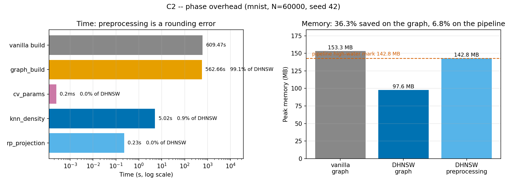

# C2 — phase overhead: RP-KNN density estimation vs graph build

DHNSW does something vanilla HNSW does not: before building the graph it
estimates a local density for every point, and that estimate is what sets the
per-node M and ef. The paper's build-time figures report the construction loop.
C2 asks what the preprocessing costs, and whether the reported saving survives
being charged for it.

```bash
python scripts/run_c2_phases.py --seed 42
# -> results/phase1/c2_phase_overhead_mnist.{csv,png}
```

MNIST, 60,000 base vectors, 100 queries, seed 42. Environment: i7-12700F,
94 GB, conda env `dhnsw`, 2026-09-04. One run (range dial 1).

## Results

| Phase | Time | Share of DHNSW total |
|---|---|---|
| `rp_projection` — Gaussian random projection, 784 → 261 | 0.23 s | 0.04 % |
| `knn_density` — brute kNN in projected space + row means | 5.02 s | 0.88 % |
| `cv_params` — Eq. (2)-(5), the M/ef ranges | 0.0002 s | 0.00 % |
| `graph_build` — the `add()` loop the paper reports | 562.66 s | 99.08 % |
| **DHNSW total** | **567.90 s** | |
| vanilla `graph_build` (no preprocessing phase) | 609.47 s | |

| | Vanilla | DHNSW | Change |
|---|---|---|---|
| Graph build only (the paper's metric) | 609.47 s | 562.66 s | **−7.68 %** |
| Including preprocessing | 609.47 s | 567.90 s | **−6.82 %** |
| Peak memory, graph | 153.26 MB | 97.60 MB | **−36.32 %** |
| Peak memory, preprocessing | — | 142.83 MB | |
| Recall@100 | 99.29 % | 98.10 % | −1.19 %p |



## Reading

**On time, the answer is clean: the preprocessing is a rounding error.** The
whole density estimate costs 5.24 s against a 562.66 s build — 0.9 % of
DHNSW's total. Charging it to DHNSW moves the build-time saving from 7.68 % to
6.82 %, well inside the run-to-run noise discussed below. The reviewer's
concern does not bite: the paper's decision to report the construction loop
does not flatter the result in any material way.

**On memory, it does bite, and this is the finding worth carrying into the
text.** The density estimate projects all 60,000 points to 261 dimensions and
runs a brute-force kNN over them, and that transient peaks at 142.83 MB —
nearly 1.5× the 97.60 MB graph it exists to shrink. The graph saving of
36.32 % is real and is what the paper's Fig. 5 is about, but a reader who
measures the *pipeline's* high-water mark sees only 153.26 → 142.83 MB, a
6.8 % saving. The two numbers answer different questions and both are true:
the resident index is a third smaller, while the peak footprint during
construction is barely improved.

That gap is an artefact of the estimator, not of DHNSW's idea. The projected
copy (60,000 × 261 float64 = 125 MB) dominates it, and it is transient — freed
before the graph build starts. Chunking the kNN, projecting in float32, or
estimating density on a sample would each cut it substantially. C8 measures
what happens when the projection itself is swapped.

**Methodological note — build times are noisy, the graph is not.** Across the
three full MNIST runs this repo has now made with identical settings:

| Run | Vanilla build | DHNSW build | Improvement | DHNSW degree | DHNSW memory |
|---|---|---|---|---|---|
| Golden master | 610.73 s | 549.29 s | 10.06 % | 17.785 | 97.36 MB |
| C7 (`linear`) | 646.24 s | 536.58 s | 16.97 % | 17.781 | 97.56 MB |
| C2 | 609.47 s | 562.66 s | 7.68 % | 17.785 | 97.60 MB |

The graph DHNSW builds is essentially deterministic — average degree varies by
0.02 % and memory by 0.25 % — while the build-time improvement swings between
7.7 % and 17.0 %, bracketing the paper's published 13.29 %. The improvement is
a ratio of two separately timed builds, so both ends of it carry the machine's
noise. **Quote memory and average degree as the load-bearing evidence; treat a
single-run build-time delta as indicative and report the spread.**

## Caveats

One dataset, one seed, one run per configuration (range dial 1). The timing
split itself is reliable — the phases differ by three orders of magnitude, far
beyond any noise — but the vanilla-versus-DHNSW build ratio is not, as above.

`tracemalloc` traces Python and NumPy allocations, not RSS, so the memory
figures describe allocated objects rather than what the OS reports.
