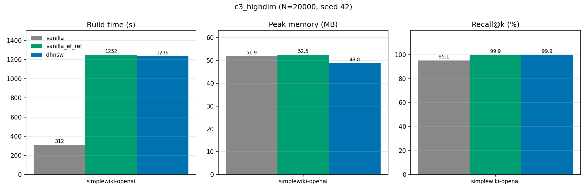

# C3 — does the gain survive at 1536d and above?

The paper's datasets run from 128 to 960 dimensions. C3 asks what happens at
the dimensionality current embedding models actually produce. The test set is
`simplewiki-openai-3072`, unit-norm OpenAI embeddings at 3072 dimensions —
more than three times the widest dataset in the paper.

```bash
python scripts/run_hdf5_experiment.py --datasets simplewiki-openai \
    --num-vectors 20000 --variants vanilla vanilla_ef_ref dhnsw --stem c3_highdim
# -> results/phase1/c3_highdim.{csv,png}
```

20,000 base vectors (subsampled under seed 42), 100 queries, ground truth
recomputed over the subsample. Vectors are unit-norm, so Euclidean ranking is
cosine ranking and the distance function is the one the paper's runs used.
Environment: i7-12700F, 94 GB, conda env `dhnsw`, 2026-09-04.

**On scale.** Pure-Python DHNSW cannot build a graph over the full 260,372
points in a reasonable time, so this is a reduced-scale run. It still answers
C3's question, which is about dimensionality rather than cardinality. Full
scale waits on the C++ port.

## Results

| Variant | ef used | Build time | Peak memory | Recall@100 | Avg degree |
|---|---|---|---|---|---|
| vanilla (paper's baseline) | 100 | 312.08 s | 51.86 MB | 95.14 % | 30.99 |
| vanilla at DHNSW's ef | 1000 | 1251.89 s | 52.52 MB | 99.93 % | 31.03 |
| **DHNSW** | ~1000 | **1235.70 s** | **48.78 MB** | **99.90 %** | **27.11** |

Against the paper's baseline, DHNSW builds **296 % slower**. Against vanilla
given the same ef budget, it builds **1.3 % faster** and uses **7.1 % less
memory** at equal recall. Both comparisons are in the table because the gap
between them is the finding.



## Reading

**The headline failure is Eq. (1), not the adaptation.** DHNSW sets its ef
reference from the dimension, `ef_ref = ef_base + (d / α)²` with α = 100. That
term is quadratic, and it was only ever exercised between 128d and 960d, where
it produces 101 to 181 — a modest bump over the vanilla ef of 100. At 3072d it
produces **1000**. Simply running vanilla HNSW at ef = 1000 costs 1251.89 s
against 312.08 s at ef = 100, a 4× slowdown that has nothing to do with DHNSW.
That single formula, extrapolated three times past its tested range, accounts
for essentially the whole 296 % regression.

**Given the same ef, the mechanism still works — but the gain has almost
evaporated.** DHNSW is 1.3 % faster and 7.1 % smaller than the matched-ef
vanilla, against 16.97 % and 36.37 % on MNIST. The mechanism is intact; there
is simply very little for it to work with.

**The reason is that CV collapses in high dimension.** DHNSW's entire
behaviour is set by δ = CV·λ (this is C7's result), and:

| | MNIST (784d) | simplewiki-openai (3072d) |
|---|---|---|
| CV of local density | 0.2634 | **0.0709** |
| δ | 0.395 | 0.106 |
| M range | [9, 22] | [14, 17] |
| Average degree vs vanilla | −42.6 % | −12.6 % |

At 3072 dimensions the local density is nearly uniform — the concentration of
distances that high-dimensional spaces are known for, measured here directly.
With CV at 0.071 the per-node M range narrows to [14, 17] around the vanilla
16, so DHNSW builds a graph that is barely distinguishable from vanilla's, and
saves accordingly. **DHNSW does not break at high dimension; it converges to
vanilla HNSW, because the density contrast it feeds on is what disappears.**

**What this means for the two knobs.** The paper's design ties build cost to
dimension in one direction (ef grows quadratically) and savings to density
contrast in the other (M narrows as CV falls). Both move the wrong way at
once as dimension rises, which is why the trade flips. The saving comes from
reduced M; the cost comes from raised ef. Above roughly 1500 dimensions the
second overwhelms the first.

## What to do about it

Eq. (1) is the actionable part, and the fix is not subtle: the quadratic term
needs either a cap or a gentler growth law outside the range it was fitted in.
`ef_ref = 1000` is not a considered choice for 3072d data, it is an
extrapolation artefact — and vanilla at ef = 100 already reaches 95.14 %
recall on this data, so the extra 4× build cost buys 4.8 %p.

The CV collapse is not fixable by changing a formula; it is a property of the
data. It does mean DHNSW's value proposition should be stated with a
condition attached: the method pays off in proportion to the density contrast
of the corpus, which is large for raw image and descriptor data (MNIST, SIFT,
GIST) and small for normalised transformer embeddings.

## Caveats

One dataset, one seed, one run per variant, at 20,000 of the available
260,372 points (range dial 1). Build times carry the run-to-run noise
documented in C2 — but the effects here are 4× and 296 %, far outside it, and
the CV figure that carries the explanation is deterministic under the seed.

Whether CV keeps falling with dimension, or whether this is specific to
OpenAI's normalised embeddings, is not settled by one dataset. C10's two 768d
backbones give a partial cross-check at a different dimension and encoder.
