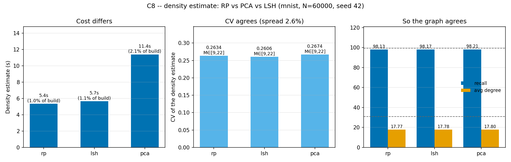

# C8 — replacing RP-KNN with PCA or LSH

DHNSW estimates local density by projecting to d/3 dimensions with a dense
Gaussian random projection, then taking the mean distance to the k nearest
neighbours in that space. C8 asks what a data-dependent projection (PCA) or a
cheaper sparse one (the primitive under most LSH families) would buy, and
whether the paper's choice is worth its cost.

```bash
python scripts/run_c8_density_method.py --seed 42
# -> results/phase1/c8_density_method_mnist.{csv,png}
```

MNIST, 60,000 base vectors, 100 queries, seed 42, λ = 1.5, M = 16,
ef_ref = 149. Only the projection changes: target dimension (784 → 261), the
kNN step, and everything downstream are held fixed. Environment: i7-12700F,
94 GB, conda env `dhnsw`, 2026-09-04. One run per method (range dial 1).

## Results

| Method | Density estimate | CV | M range | Build time | Memory | Recall | Avg degree |
|---|---|---|---|---|---|---|---|
| vanilla (no estimate) | — | — | M = 16 | 644.91 s | 153.34 MB | 99.29 % | 30.99 |
| **`rp` (paper's)** | **5.35 s** | **0.2634** | **[9, 22]** | **535.79 s** | **97.64 MB** | **98.13 %** | **17.769** |
| `pca` | 11.40 s | 0.2674 | [9, 22] | 529.69 s | 97.57 MB | 98.21 % | 17.802 |
| `lsh` (sparse RP) | 5.66 s | 0.2606 | [9, 22] | 529.88 s | 97.71 MB | 98.17 % | 17.784 |



## Reading

**The three estimators disagree about the projection and agree about
everything that matters.** The CV they produce spans 0.2606–0.2674, a 2.6 %
spread, and after Eq. (2)-(3) truncates it into integers all three land on the
*identical* M range [9, 22]. The graphs that follow are then indistinguishable:
average degree within 0.19 %, peak memory within 0.14 %, recall within
0.08 %p — all well inside the run-to-run noise established in C2.

This is the same structure C7 found from the other direction. C7 showed the
outcome depends on the CV term only through one scalar, δ; C8 shows that
scalar is insensitive to how the density is estimated. Together they say
DHNSW's behaviour is governed by a single number that is robust to both the
functional form used to derive it and the projection used to measure it.
That is a robustness result, and it is the right answer to give C8.

**What the paper's choice costs: essentially nothing, and PCA costs double for
nothing.** The Gaussian projection itself is 0.23 s of the 5.35 s estimate
(C2's breakdown); the kNN search is the rest. PCA has to fit a 261-component
decomposition first, which doubles the estimate to 11.40 s — and returns a CV
1.5 % different, which changes no downstream number. Since C2 already showed
the whole estimate is 0.9 % of DHNSW's build time, none of this is worth
optimising: the paper's choice is cheap, and the alternatives are neither
cheaper in any useful sense nor better.

**A negative result worth recording: sparse projection is not faster here.**
`lsh` was expected to undercut `rp` on projection cost, and it did not
(5.66 s against 5.35 s). Sparse matrix multiplication loses to a dense BLAS
`gemm` at this shape, and the kNN step that dominates is identical for both.
The theoretical advantage of sparse projections does not survive contact with
an optimised dense kernel at 60,000 × 784.

## Caveats and what would come next

One dataset, one seed, one run per method (range dial 1). The differences
being reported are *absences* of differences, which is the safer direction for
a single-run result: the claim is that three methods agree to within a fraction
of a percent, and noise would produce disagreement, not agreement.

MNIST's CV of 0.26 sits in the regime where Eq. (2)-(3) truncates to the same
integer M range for all three methods. On a dataset with a larger CV spread
between estimators the integer truncation could separate them, so if this is
pushed to range dial 2, prefer datasets whose density profile differs sharply
from MNIST's — the same follow-up C7 asks for.
